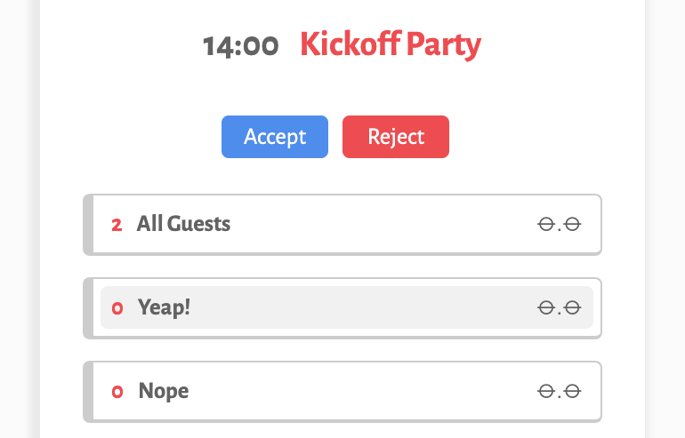

# EventSauce
[Event Sauce](https://event-sauce.vercel.app)

Event Sauce is a web-based application that allows users to create, manage, and track events. It is designed to simplify the process of organizing and coordinating events.

## AS A PLANNER:

1. **Create events**: Choose between event, event with transportaion or only transportation

2. **Manage guest lists**: Edit, add, remove and see your guests restrictions

3. **Manage Passengers**: See who opted in to your transportation offer

## AS A GUEST:

4. **Update your preferences**: Save your restrictions and help planners know if you are alergic or need any assistance with accessibility needs

6. **Invitation management**: Let planners know how you are joining the event and keep track of details

## COMING SOON...

- **Integration with Google Calendar (not implemented yet)**
- **Automatic emails sent on RSVP date to guests that have not responded**

## Try it for yourself

[Event Sauce](https://event-sauce.vercel.app)