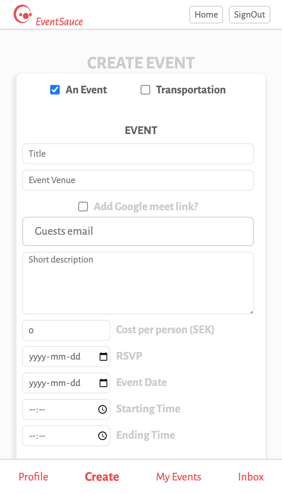
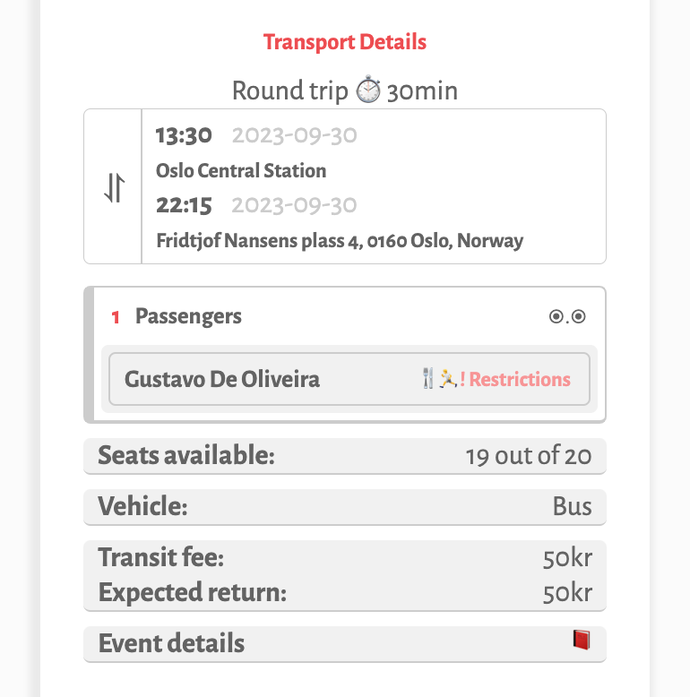
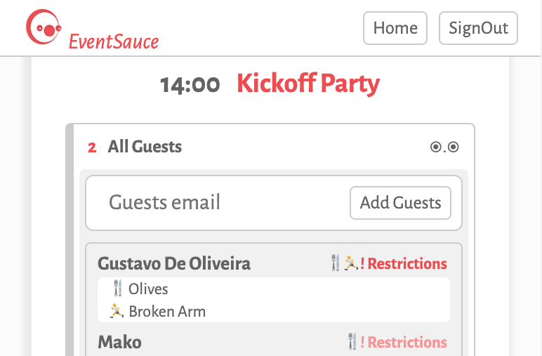
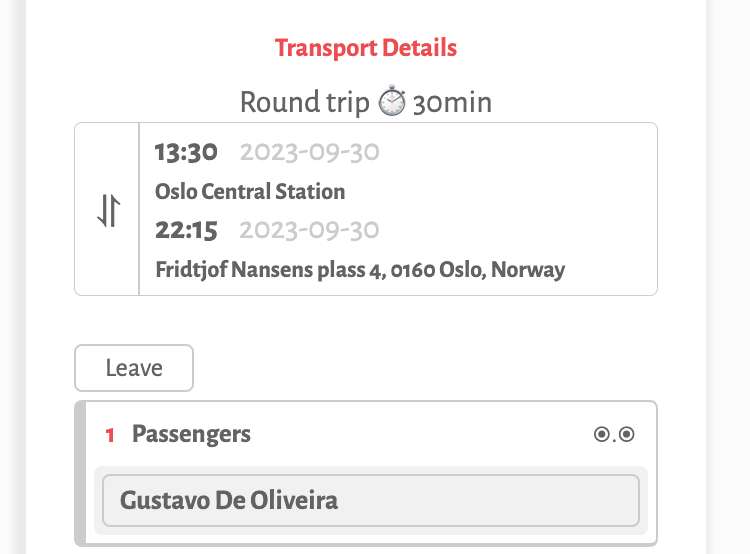
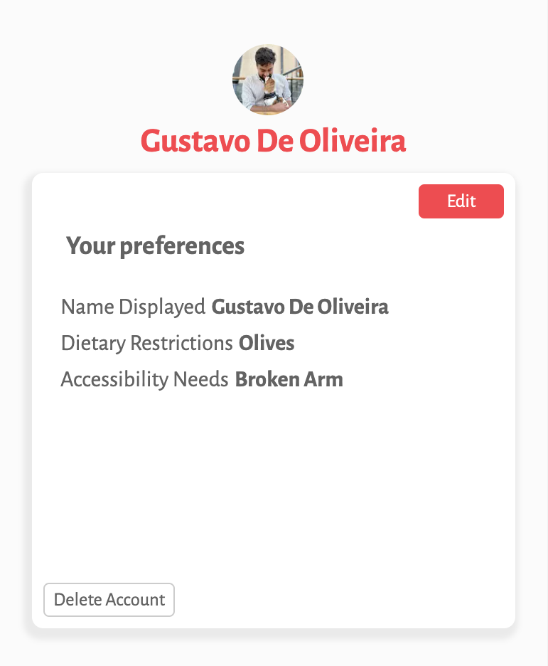

# EventSauce
[Event Sauce](https://event-sauce.vercel.app)

Event Sauce is a web-based application that allows users to create, manage, and track events. It is designed to simplify the process of organizing and coordinating events.

## AS A PLANNER:
1. **Create events** - <i>Specify the event details. Choose between event, event with transportaion or only transportation</i>
 
 

2. **Manage guest lists** - <i>Edit events and/or transportation, keep track of attendance and see if guests have restrictions</i>
 
 

## AS A GUEST:

3. **Invitation Inbox** - <i>Let planners know how you are joining the event and keep track of details</i>
 
 

4. **Update your preferences** - <i>Save your restrictions and help planners know if you are alergic or need any assistance with accessibility needs</i>
 
 

## COMING SOON...

- **Integration with Google Calendar**
- **Automatic emails sent on RSVP date to guests that have not yet responded**

## Try it for yourself

[Event Sauce](https://event-sauce.vercel.app)